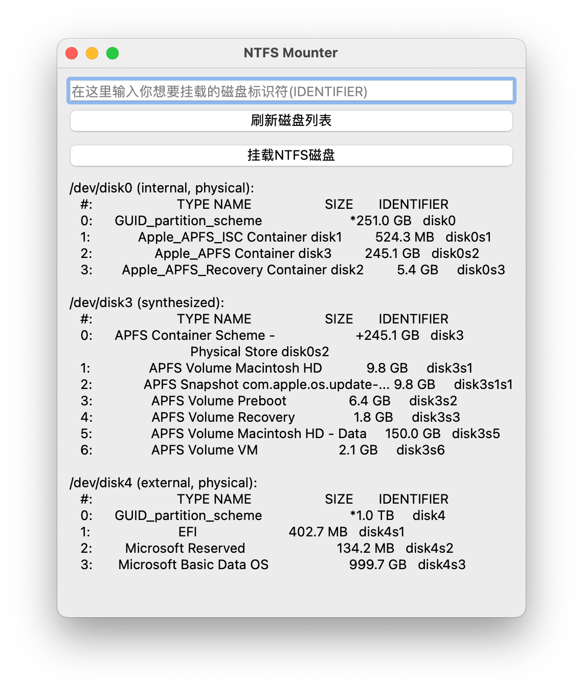

# NTFS Mounter 
Author: Kevin Stark  
Date: 2024/06/15  
Version: 1.1  

## 说明
这个项目是基于[原项目](https://github.com/enlian/ntfs-for-mac)的一个fork。  
* 原项目没有交互界面，为人机交互考虑，增加了用PyQt5写的GUI。  
* 原项目需要手动进入bash，在命令行或文本编辑器里修改磁盘标识符，不灵活，于是增加了查看磁盘列表、输入磁盘标识符的功能。  

## 使用方法
首先要把相关依赖和设置配好，
1. `homebrew、macfuse、ntfs-3g-mac`，详情看下面正文
2. 系统安全性设置，详情看下面正文
3. Python包PyQt5 可以通过`pip install PyQt5`获得。  

GUI有三种使用方案。

* 方案一：在终端运行`python3 ntfs_mounter.py`，在GUI里确认挂载后在终端输入计算机密码。
* 方案二：用QProcess实现，和方案一效果没区别。
* 方案三：在终端中运行`sudo python3 ntfs_mounter.py`，只需要一开始在终端输入密码就行，不用在程序运转时输入了。
* 默认是方案一。如需修改请自行在`ntfs_mounter.py`的mountNTFSDisk内找到相关代码，注释和解除注释。  

GUI路径：ntfs-mounter/ntfs_mounter.py  

也用Pyinstaller创建了可执行程序，解压`dist.tar.gz`后进入路径，双击ntfs_mounter就可以用，不需要安装Python的PyQt5包。 

可执行程序路径：ntfs-mounter/dist/ntfs_mounter/ntfs_mounter  

注意，一切使用前提是把相关依赖和设置配好。  

以下为原项目介绍：

------------

旨在帮助你用简单的几句命令行，实现在mac系统读取写入NTFS移动硬盘或者U盘的功能。

配置完成后，只需要点击挂载或者卸载移动硬盘，不再需要使用命令行。

目前已经支持到最新的苹果macos 13.x系统和m1、m2芯片。

并且会跟随苹果系统更新而更新使用方法，帮你省去购买Paragon、TUXERA的费用，

喜欢的可以star一下，谢谢你的支持。

------------

###### 本项目依赖：
homebrew、macfuse、ntfs-3g-mac

# 使用方法：

# 1.安装homebrew
⌘+space输入终端复制以下代码粘贴至终端，安装完成重启终端。（macOS下包管理器）

`/bin/bash -c "$(curl -fsSL https://raw.githubusercontent.com/Homebrew/install/HEAD/install.sh)"`

# 2.关闭电脑安全性设置
这是使用系统扩展插件的常规操作。
- 2.1 “通用”中“隐私与安全性”，允许任何来源，可直接终端
  `sudo spctl --master-disable`

- 2.2 关闭SIP，输入 `csrutil disable` 重启
- 2.3 关机后长按开机键，进入“恢复”环境，在“实用工具”->“启动安全性实用工具”降低安全性的选项全都都勾上（出现不能更改安全性设置，关机盒盖，30秒后再操作一遍即可）

# 3.安装fuse
- 命令行
  `brew tap gromgit/homebrew-fuse`
- 安装macfuse
  `brew install --cask macfuse`
- 然后安装ntfs-3g-mac
  `brew install ntfs-3g-mac`

# 4.查看挂载信息
`diskutil list`

找到你的移动硬盘的名字，标红的就是名字

# 5.挂载硬盘
- 5.1挂载前先卸载（防止报错）
  `sudo umount /dev/disk4s1`

disk4s1就是你的硬盘名字，每个人可能不一样

- 5.2挂载硬盘
  `sudo /System/Volumes/Data/opt/homebrew/bin/ntfs-3g /dev/disk4s1 /Volumes/NTFS -olocal -oallow_other -o auto_xattr`

注意替换硬盘名字，以及你的ntfs-3g目录可能不一样，注意替换

------------

# 总结：
我把挂载和卸载命令做成了可执行文件，你可以复制下来直接双击打开使用，免去每次都输入命令行的麻烦。

##### 挂载：

    #！ /bin/bash
    sudo umount /dev/disk4s1
    sudo /System/Volumes/Data/opt/homebrew/bin/ntfs-3g /dev/disk4s1 /Volumes/NTFS -olocal -oallow_other -o auto_xattr
    sudo exit

##### 卸载：

    #！ /bin/bash
    sudo umount /dev/disk4s1
    sudo exit

---

This project aims to help you use a few simple command lines to realize the function of reading and writing NTFS mobile hard disk or U disk on mac system.

After the configuration is complete, you only need to click to mount or unmount the mobile hard disk, and you no longer need to use the command line.

At present, it has supported the latest Apple macos 13.x system and m1 and m2 chips.

And it will update the usage method following the update of the Apple system, saving you the cost of purchasing Paragon and TUXERA,

If you like it, you can star it, thank you for your support.

This project depends on:
homebrew, macfuse, ntfs-3g-mac

Instructions:

# 1. Install homebrew
⌘+space, enter the terminal, copy the following code and paste it to the terminal, and restart the terminal after the installation is complete. (Package Manager under macOS)

`/bin/bash -c "$(curl -fsSL https://raw.githubusercontent.com/Homebrew/install/HEAD/install.sh)"`

# 2. Turn off computer security settings
This is normal operation with system extensions.
- 2.1 "Privacy and Security" in "General", allowing any source, you can directly terminal
  `sudo spctl --master-disable`
- 2.2 Close SIP, enter
  `csrutil disable `
  and restart
- 2.3 After shutting down, press and hold the power button to enter the "Recovery" environment, and tick all the options to reduce security in "Utilities" -> "Start Security Utility" (the security settings cannot be changed, shut down the box cover, 30 You can do it again in seconds)

# 3. Install fuse
- Command Line
  `brew tap gromgit/homebrew-fuse`
- install macfuse
  `brew install --cask macfuse`
- Then install ntfs-3g-mac
  `brew install ntfs-3g-mac`

# 4. Check the mount information
`diskutil list`

Find the name of your mobile hard drive, the red one is the name

# 5. Mount the hard disk
- 5.1 Uninstall before mounting (to prevent error reporting)
  `sudo umount /dev/disk4s1`

disk4s1 is the name of your hard disk, everyone may be different

- 5.2 Mount the hard disk
  `sudo /System/Volumes/Data/opt/homebrew/bin/ntfs-3g /dev/disk4s1 /Volumes/NTFS -olocal -oallow_other -o auto_xattr`

Pay attention to replace the hard disk name, and your ntfs-3g directory may be different, pay attention to replace

------------

# Summarize:
I made the mount and uninstall commands into executable files, you can copy them and double-click to open them directly, saving you the trouble of entering the command line every time.

###### mount:

    #! /bin/bash
    sudo umount /dev/disk4s1
    sudo /System/Volumes/Data/opt/homebrew/bin/ntfs-3g /dev/disk4s1 /Volumes/NTFS -olocal -oallow_other -o auto_xattr
    sudo exit

###### Uninstall:

    #! /bin/bash
    sudo umount /dev/disk4s1
    sudo exit
